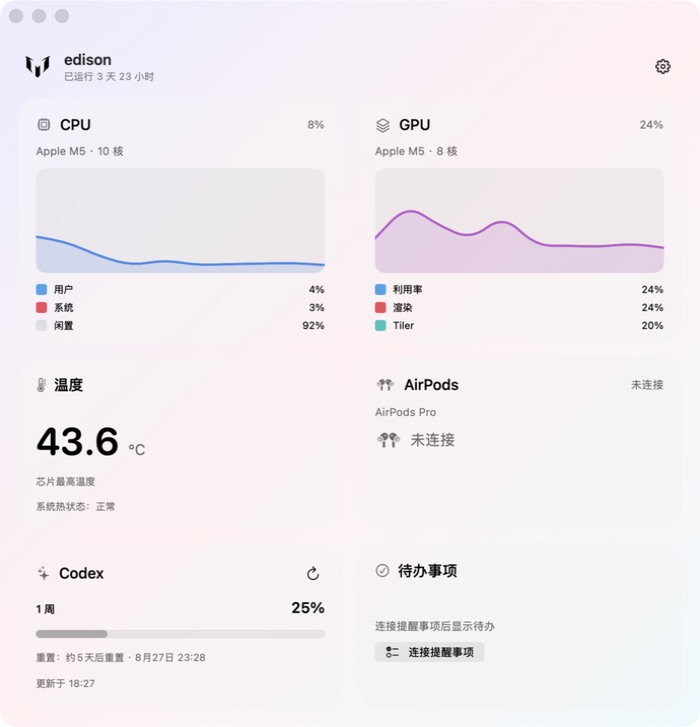

# edison

一个 macOS 菜单栏状态监控应用。

## 功能

- 查看 CPU 使用率、用户/系统/闲置占比和实时曲线
- 查看 GPU 使用率、渲染占比与 Tiler 占比
- 显示芯片温度与系统热状态
- 显示 AirPods Pro 左右耳和充电盒电量、连接状态
- 查看 Codex 当前额度、重置时间和最近更新时间
- 连接 macOS“提醒事项”，显示最近待办、快速新增并勾选完成
- 显示 Mac 已运行时间
- 支持登录后自动启动

## 外观

应用同时适配 macOS 浅色模式和深色模式。

菜单栏图标采用“10”号图案，致敬最伟大的阿根廷 10 号、巴萨 10 号——梅西。点击图标即可打开状态面板；应用运行在菜单栏中，不显示在 Dock。

## 安装

下载 `outputs/edison.app.zip`，解压后将 `edison.app` 拖入“应用程序”文件夹即可启动。

首次打开自签名应用时，如 macOS 弹出提示，请在 Finder 中右键点击应用，选择“打开”并确认。

首次使用待办事项时，点击卡片中的“连接提醒事项”，再在系统弹窗中允许访问。应用只在打开面板、新建或完成待办后刷新提醒事项，不进行后台轮询。
